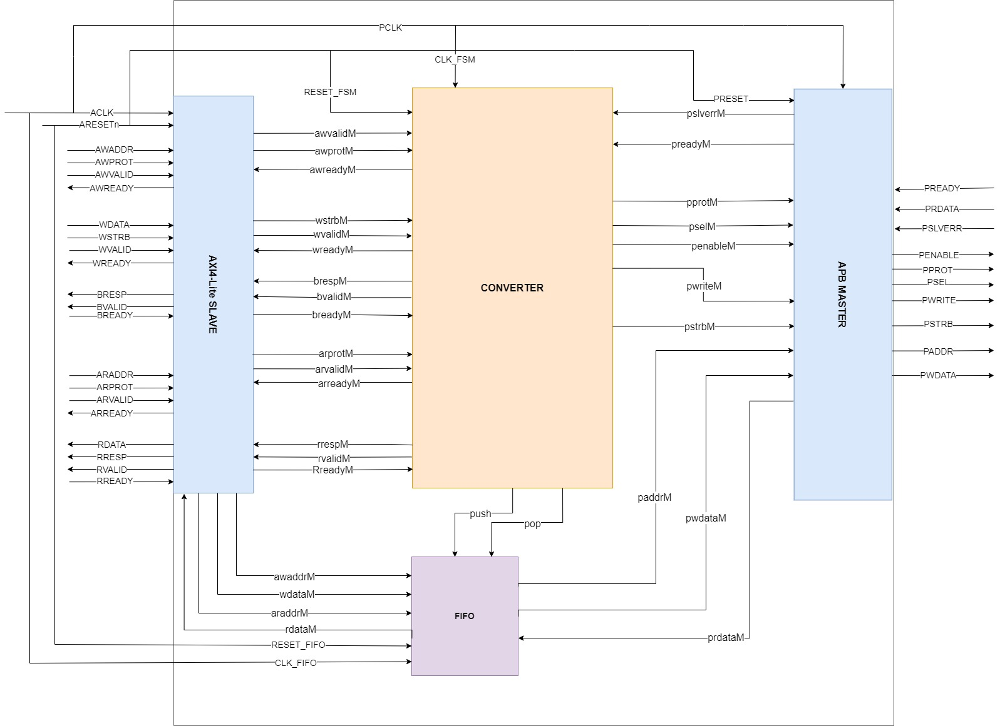

# Документация для проекта AXI4-Lite - APB4 bridge

## Введение

Мост AXI4-Lite и APB - это компонент, который выполняет преобразование операций данных и команд между двумя разными интерфейсами. Он работает как ведомое устройство на интерфейсе AXI4-Lite и как ведущее устройство на интерфейсе APB. 

Главная задача моста AXI-APB заключается в обеспечении связи между периферийными устройствами, подключенными к интерфейсу APB, и основными устройствами, подключенными к интерфейсу AXI. 

## Основные характеристики
- Поддержка двунаправленной передачи данных между компонентами СнК
- Интерфейс AXI основан на спецификации AXI4-Lite.
- Интерфейс APB основан на спецификации APB4.
- Поддержка шин данных разной ширины.
- Не используются сигналы APB: PAUSER, PWUSER, PRUSER, PBUSER
- Работа осуществляется на одном тактовом сигнале
## Состав и структура

## Внешние интерфейсы
В этом проекте используются интерфейсы APB4 и AXI4-Lite
### AXI:
| Название сигнала | Направление| Разрядность| Синхронность | Описание |
|------------|------------|------------|------------|------------|
|AWADDR | Input| AW | Синхронный| Используется для передачи адреса при операции записи |
|AWPROT | Input |3 |Синхронный|Oпределяет уровень защиты при операции записи|
|AWVALID| Input|1|Синхронный|Сигнал, указывающий, что сигналы AWADDR и AWPROT действительны|
|AWREADY|Output| 1 |Синхронный|Сигнал, указывающий, что слейв готов принимать адресные запросы на запись|
| | | |
|WDATA|Input|DW|Синхронный|Шина данных, используется для передачи данных при операции записи|
|WSTRB|Input|DW/8|Синхронный|Маска, указывающая, какие байты данных из WDATA действительны|
|WVALID|Input|1|Синхронный| Сигнал, указывающий, что данные и маска WDATA и WSTRB действительны|
|WREADY|Output|1|Синхронный|Сигнал, указывающий, что слейв готов принимать данные для операции записи|
| | | | 
|BRESP|Output|2|Синхронный| 2-битный сигнал, указывающий результат операции записи|
|BVALID|Output|1|Синхронный|Сигнал, указывающий, что информация на сигнале BRESP действительна|
|BREADY|Input|1|Синхронный|Сигнал, указывающий, что мастер готов принимать ответы на операции записи|
| | | | 
|ARADDR|Input|AR|Синхронный|Сигнал, используется для передачи адреса при операции чтения|
|ARPROT|Input|3|Синхронный|Характеристика входа или выхода: 3-битный сигнал, определяет уровень защиты при операции чтения|
|ARVALID|Input|1|Синхронный|Сигнал, указывающий, что сигналы ARADDR и ARPROT действительны|
|ARREADY|Output|1|Синхронный|Сигнал, указывающий, что слейв готов принимать адресные запросы на чтение|
| | | |
|RDATA|Output|DR|Синхронный|Шина данных, используется для передачи данных при операции чтения|
|RRESP|Output|1|Синхронный|2-битный сигнал, указывающий результат операции чтения|
|RVALID|Output|1|Синхронный|Сигнал, указывающий, что данные на сигнале RDATA и значение RRESP действительны|
|RREADY|Input|1|Синхронный|Сигнал, указывающий, что мастер готов принимать данные, возвращаемые операцией чтения|

- AW - параметр, определяющий ширину сигнала адреса в режиме записи
- DW - параметр, определяющий ширину сигнала данных в режиме записи
- AR - параметр, определяющий ширину сигнала адреса в режиме чтения
- DR - параметр, определяющий ширину сигнала данных в режими чтения
### APB:
| Название сигнала | Направление| Разрядность|Синхронность|Описание|
|------------|------------|------------|------------|------------|
|PSELx|Output|1|Синхронный|Сигнал, который показывает, что конкретный исполнитель выбран и требуется транзакция|
|PENABLE|Output|1|Синхронный|Разрешение возможности транзакции|
|PPROT|Output|3|Синхронный|Сигнал доступа(защиты)|
|PADDR|Output|ASIZE|Синхронный|Шина адреса транзакции|
|PWRITE|Output|1|Синхронный|Выбор записи или чтения|
|PWDATA|Output|DW|Синхронный|Шина данных для записи|
|PSTRB|Output|DW/8|Синхронный|Сигнал, который указывает какой байт PWDATA будет записываться|
|PREADY|Input|1|Синхронный|Готовность slave совершать новую транзакцию|
|PRDATA|Input|DR|Синхронный|Шина данных для чтения|
|PSLVERR|Input|1|Синхронный|Сигнал, указывающий на ошибку передачи данных|
- ASIZE - параметр ширины сигнала адреса
- DW - параметр ширины данных при записи
- DR - параметр ширины данных при чтении

## Синхронизация и сброс
|Название сигнала |Направление|Ширина|Синхронность|Описание|
|------------|------------|------------|------------|------------|
|ACLK|input|1|Синхронный|Системная тактовая частота|
|ARESETn|input|1|Асинхронный|Асинхронный сброс с активным низким уровнем|

## Функциональное описание

 Работа моста будет происходить посредством модуля контроллера - конечного автомата.Ниже представлены стадии FSM.
  1. IDLE - состояние моста по умолчанию, происходит переход в следующее состояние по готовности транзакции, если handshake активен по записи или чтению.
  2. DECODE - состояние настройки, когда запрашивается транзакция с AXI-мастера, в этом состоянии устанавливаются необходимые сигналы для передачи данных read или write. Если error неактивен, то на следующий такт происходит переход в следующее состояние, если error активен, то перехода нет.
  3. RUN - состояние происходящей транзакции, все сигналы уже установлены, если транзакция завершается, то автомат переходит в исходное состояние IDLE, если транзакция активна, то автомат возвращается в состояние DECODE.
   

<!--

<!--
### AXI4-Lite
Для интерфейса AXI4-Lite состояния будут следующие:
   1. IDLE - состояние интерфейса по умолчанию, без транзакции
### APB
Для интерфейса APB состояния будут следующие:
  1. IDLE - состояние интерфейса по умолчанию, без транзакции
  2. SETUP - когда требуется транзакция, интерфейс переходит в состояние SETUP, в котором активен
сигнал Psel. Интерфейс остается в состоянии SETUP только в течение одного такта и всегда переходит в состояние ACCESS при следующем нарастании тактового импульса.
  1. ACCESS - Разрешающий сигнал, PENABLE, утверждается в состоянии ACCESS. 
Выход из состояния ACCESS контролируется сигналом PENABLE от завершителя. Если значение PREADY на низком уровне, то интерфейс остается в состоянии ACCESS. Если PREADY становится активным и транзакция еще происходит (PSEL = 1), то автомат переходит в режим SETUP. Если же PREADY активен, но транзакции больше нет (PSEL = 0), то автомат переходит в состояние ожидания IDLE.
-->

Работа для AXI4-Lite описывается на этой диаграмме состояний.
## История версий

v.01
v.02
